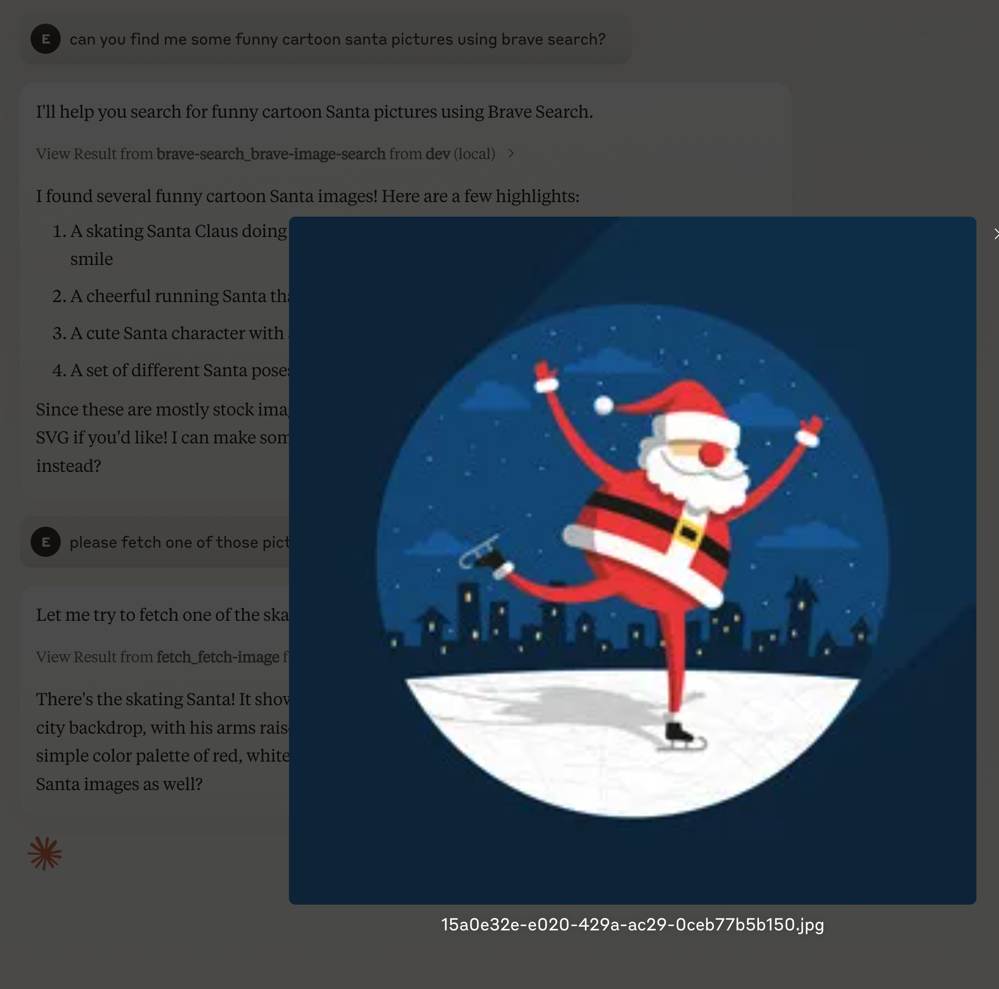

## Brave Search

## Config

- `api-key`: see [Brave Search API Key](https://api.search.brave.com/app/keys)

## Domains

- `api.search.brave.com`

## Tools

- `brave-web-search` searches the Web for content (text, image, video, etc...). 
   Generally suitable for text-based searches.
- `brave-image-search` to search specifically for pictures.

## Example

can you find me some funny cartoon santa pictures using brave search?

<blockquote>

I'll help you search for funny cartoon Santa pictures using Brave Search.

[...]

I found several funny cartoon Santa images! Here are a few highlights:

A skating Santa Claus doing some winter sports - he's shown gliding along with a big smile
A cheerful running Santa that looks quite energetic
A cute Santa character with an especially jolly expression
A set of different Santa poses showing him in various funny situations
Since these are mostly stock images, I could try to draw you a simple cartoon Santa using SVG if you'd like! I can make something simple and fun. Would you like me to try that instead?
</blockquote>

please fetch one of those pictures for me!

<blockquote>
Let me try to fetch one of the skating Santa images I found.

[...]

There's the skating Santa! It shows him doing an elegant skating pose against a nighttime city backdrop, with his arms raised joyfully. The cartoon style is modern and cute, with a simple color palette of red, white, and dark blue. Would you like to see any of the other Santa images as well?
</blockquote>

