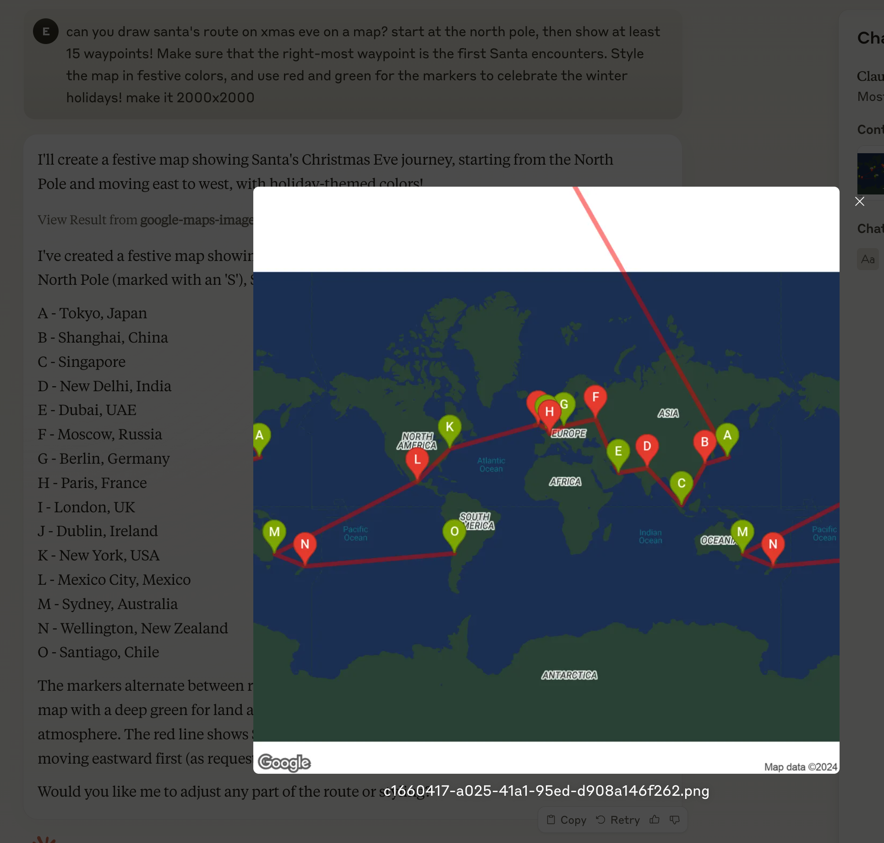

# Google Maps Static Image API

Generates an image using [Google's static Map generation API](https://developers.google.com/maps/documentation/maps-static/start).

## Config

- `api-key`: see [docs](https://developers.google.com/maps/documentation/maps-static/get-api-key)

## Domains

- `maps.googleapis.com`

## Example

> can you draw santa's route on xmas eve on a map? start at the north pole, then show at least 15 waypoints! Make sure that the right-most waypoint is the first Santa encounters. Style the map in festive colors, and use red and green for the markers to celebrate the winter holidays! make it 2000x2000

